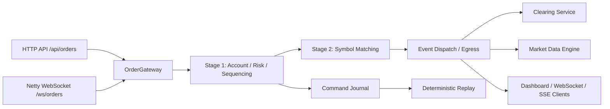

# ProTrade X Trading Engine

ProTrade X, also referred to as Vision Trader in the runtime modules, is an ultra-low-latency ECN-style electronic trading exchange core written in Java. The project evolved from a traditional order book simulator into a deterministic, event-driven matching venue with a mechanically sympathetic execution pipeline.

The current architecture focuses on strict sequencing, cache-friendly data layouts, bounded object reuse, pre-trade risk serialization, deterministic replay, and low-jitter WebSocket order ingress. The latest three-run verification sustained **500 concurrent WebSocket users** with **295,294 accepted order acknowledgements**, **zero connection failures**, **zero ACK timeouts**, and a **31ms worst-run p99** against a strict sub-50ms SLA.

## Executive Summary

| Capability | Implementation |
| --- | --- |
| Matching model | Deterministic price-time priority matching |
| Ingress | HTTP/Javalin plus Netty WebSocket order entry |
| Risk model | Serialized account/risk stage for buying-power and position validation |
| Concurrency model | Single-writer principles, staged handoff, isolated symbol matching |
| Hot-path allocation strategy | Flyweight mutation, bounded pools, primitive state tracking |
| Market data | L2 depth, trade tape, OHLCV, execution reports, account projections |
| Persistence | Append-only command journaling with replay-oriented recovery |
| Observability | k6, JFR, JUnit, Playwright, JMH-ready benchmark scaffolding |

## Architecture



## System Dashboard & Telemetry

The Javalin operational console renders state produced by the same matching, clearing, and market-data services used by the WebSocket execution path. It does not maintain a separate simulated account or synthetic browser-side order book.

<p align="center">
  
</p>

<p align="center"><em>Live L2 depth and account projections sourced from the event-driven exchange runtime.</em></p>

<p align="center">
  
</p>

<p align="center"><em>Gateway-to-shard-to-dispatch telemetry with per-symbol queue depth and a rolling latency view.</em></p>

### Two-Stage Execution Pipeline

| Stage | Responsibility | Low-Latency Mechanics |
| --- | --- | --- |
| Ingress edge | Accept HTTP and WebSocket order flow | Netty WebSocket ingress is the optimized path; HTTP remains available for dashboard/API use and control-plane testing. |
| Stage 1: Account/Risk/Sequencing | Validate commands, serialize account mutation, reserve cash/positions, assign deterministic sequence numbers | Cross-symbol account state is protected by a serialized risk lane so concurrent symbol shards cannot overdraw the same client account. |
| Command journal | Persist the sequenced command stream for replay | Append-only command journaling is treated as the deterministic replay authority; relational persistence remains an async audit/read-model concern. |
| Stage 2: Matching | Route sequenced commands into isolated symbol matching logic | Symbol-local matching keeps price-time priority deterministic while avoiding global engine locks. |
| Event dispatch | Publish fills, cancels, rejects, account updates, and market data deltas | Mutable event batches and preallocated ring-buffer style handoff reduce defensive copy churn. |
| Market data engine | Maintain L2 depth, trade tape, OHLCV candles, and UI projections | Projection state is bounded and reused to avoid TLAB fragmentation under bursty market-data fanout. |
| Clearing service | Settle buyer/seller cash and positions from execution events | Post-trade settlement is event-driven and kept outside direct order book mutation. |

### Stage 1: Serialized Account and Risk Core

The first stage exists to solve a real exchange-engine problem: account state is global, while matching can be symbol-local. If two orders for the same client hit different symbols at the same time, buying power and reserved position state must still be updated deterministically.

Stage 1 handles:

- inbound command validation;
- account buying-power checks;
- sell-side available-position checks;
- cash and position reservation;
- monotonic sequencing;
- command journal append;
- routing to the matching stage only after risk acceptance.

This stage is intentionally serialized around account mutation. It favors correctness and deterministic replay over naive parallelism.

### Stage 2: Symbol Matching and Event Publication

The second stage executes the exchange venue logic:

- price-time priority matching;
- partial fills;
- IOC/FOK behavior;
- self-trade prevention;
- order cancel/modify/admin command handling;
- event publication into clearing, market data, and client execution-report paths.

Stage 2 is designed around the single-writer principle for each symbol book. Matching state is mutated by one logical owner, which avoids locks around the order book itself and keeps execution behavior replayable.

## Low-Latency & Zero-Allocation Design Principles

The sub-50ms WebSocket order-path result was achieved by progressively removing GC-heavy structures and blocking handoffs from the active order lifecycle.

| Principle | Applied Technique |
| --- | --- |
| Mechanical Sympathy | Prefer cache-friendly primitive fields and stable memory layouts over object graphs. |
| Allocation-Disciplined Hot Path | Mutate primitive quantities such as `leavesQty` and `cumQty` in place and reuse bounded carriers instead of allocating fresh lifecycle objects at every transition. |
| Flyweight Pattern | Reuse mutable command/event carriers across staged processing boundaries rather than creating defensive immutable snapshots for every transition. |
| Lock-Free Object Pooling | Use bounded array-backed recycling for risk structures such as `CashReservation` and `RestingRiskOrder` to avoid repeated `HashMap$Node` and short-lived state allocations. |
| TLAB Fragmentation Mitigation | Remove allocation spikes discovered through JFR allocation profiling, especially in parsing, projection, risk reservation, and event formatting. |
| Egress Formatting Optimization | Replace expensive formatting paths such as `String.format()` with custom byte/cent appenders for outbound WebSocket payloads. |
| Backpressure Discipline | Prevent slow WebSocket consumers from stalling the core by monitoring Netty channel writability and protecting the event egress path. |
| Replay Determinism | Treat sequenced commands as the source of truth so state can be reconstructed in order after restart. |

## Verified Benchmark

Profile: three consecutive 500-VU Netty WebSocket order-entry runs using terminal IOC commands, a 200ms per-VU submission interval, and a 30-second saturation hold. Latency is measured from client send to correlated execution-report ACK.

| Run | Accepted p95 | Accepted p99 | Accepted ACKs | ACK timeouts | Connection failures | Total GC pause |
| --- | ---: | ---: | ---: | ---: | ---: | ---: |
| 1 | 5ms | 18ms | 98,294 | 0% | 0% | 0.119ms |
| 2 | 5ms | 10ms | 98,500 | 0% | 0% | 0.166ms |
| 3 | 6ms | 31ms | 98,500 | 0% | 0% | 0.154ms |
| **Aggregate** | **5.33ms avg** | **19.67ms avg / 31ms worst** | **295,294** | **0%** | **0%** | **0.146ms avg** |

These numbers describe the calibrated benchmark profile above, not an unconditional production throughput guarantee. The WebSocket path passed the repository's `<50ms` accepted-ACK p99 threshold in all three runs.

Full report: [`Trading Platform/docs/BENCHMARK_REPORT.md`](Trading%20Platform/docs/BENCHMARK_REPORT.md)

## Runtime Requirements

| Dependency | Version / Notes |
| --- | --- |
| Java | Java 21 or newer |
| Maven | Maven 3.9+ |
| k6 | Optional, required for load tests |
| Docker Desktop | Optional, for PostgreSQL / Prometheus / Grafana workflows |
| PostgreSQL | Optional audit persistence target |

## Quick Start

```bash
cd "Trading Platform"
./scripts/run-local.sh
```

Open:

```text
Dashboard:             http://localhost:8080
WebSocket orders:      ws://localhost:9090/ws/orders
WebSocket market data: ws://localhost:9090/ws/market-data
```

## Configuration

Create a local environment file:

```bash
cd "Trading Platform"
cp .env.example .env.local
```

Run with local overrides:

```bash
set -a
source .env.local
set +a
./scripts/run-local.sh
```

Common benchmark/runtime variables:

```bash
RISK_OBJECT_POOL_SIZE=262144
MDE_ORDER_PROJECTION_POOL_SIZE=524288
SKIP_STATE_HYDRATION=true
CLEAN_ROOM_ORDERS=false
USE_MAPPED_JOURNAL=false
USE_CHRONICLE_JOURNAL=false
```

Market-data bootstrap variables:

```bash
MARKET_DATA_PROVIDER=simulated
MARKET_DATA_SYMBOLS=AAPL,GOOGL,MSFT,TSLA,AMZN
POLYGON_API_KEY=your_key_here
```

## Run Tests

Run the complete Java suite:

```bash
cd "Trading Platform"
mvn -q test
```

Focused correctness suites:

```bash
mvn -q -Dtest=OrderBookCorrectnessTest test
mvn -q -Dtest=OrderGatewayPipelineTest,CoreRiskEdgeCaseTest test
mvn -q -Dtest=NettyWebSocketServerIntegrationTest test
mvn -q -Dtest=MarketDataEngineTest,ClearingSettlementTest test
```

## Run the WebSocket Load Test

Install k6:

```bash
brew install k6
```

Run the complete three-pass verification, including Maven tests and JFR extraction:

```bash
cd "Trading Platform"
./scripts/verify-all.sh
```

For one profiled benchmark pass:

```bash
cd "Trading Platform"
./scripts/run-profile.sh
```

The benchmark runner preallocates larger risk and market-data pools:

```bash
RISK_OBJECT_POOL_SIZE=262144
MDE_ORDER_PROJECTION_POOL_SIZE=524288
```

## Observability

Start Prometheus and Grafana:

```bash
cd "Trading Platform"
./scripts/run-observability.sh
```

Open:

```text
Prometheus: http://localhost:9091
Grafana:    http://localhost:3000
```

## Project Layout

```text
Trading Platform/
|-- src/
|   |-- exchange/
|   |   |-- core/                 Deterministic runtime, sequencing, matching orchestration
|   |   |-- gateway/              OrderGateway and validation boundary
|   |   |-- risk/                 Client accounts, reservations, pre-trade checks
|   |   |-- dispatch/             Event dispatcher, mutable event batches, ring-buffer events
|   |   |-- marketdata/           L2, trade tape, OHLCV, market-data egress
|   |   |-- journal/              command journals and replay infrastructure
|   |   |-- ws/                   Netty WebSocket gateway and codecs
|   |   |-- clearing/             event-driven post-trade clearing
|   |   `-- replication/          active-passive replication groundwork
|   |-- sim/                      market-maker and liquidity-taker simulators
|   |-- web/                      Javalin dashboard/API shell
|   `-- test/                     JUnit integration and correctness suites
|-- tests/
|   |-- e2e/                      Playwright UI/network resiliency tests
|   `-- load/                     k6 HTTP and WebSocket load profiles
|-- scripts/                      local, benchmark, and observability runners
|-- docs/                         benchmark and architecture reports
|-- grafana/                      dashboard provisioning
|-- docker-compose.yml            optional infrastructure services
`-- pom.xml                       Maven build definition
```

## Important Boundary

ProTrade X is a simulated exchange venue and research-grade execution core. It is not a broker, not a live trading system, and not connected to a protected SIP/NBBO feed by default. The built-in universe is simulated unless an external market-data provider is configured, and all matching occurs inside this engine.
