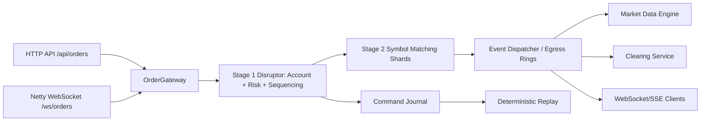

# Vision Trader

Vision Trader is a Java 21 electronic trading engine and dashboard built around a deterministic exchange core. Orders enter through HTTP or Netty WebSocket, pass through a serialized account/risk stage, route into symbol matching, then publish execution reports and market data through asynchronous event pipelines.

## What It Does

- Accepts order entry through `/api/orders` and `/ws/orders`.
- Supports JSON WebSocket orders and a fixed binary WebSocket order frame.
- Validates and reserves cash/positions before matching.
- Matches orders with deterministic price-time priority.
- Publishes L2 depth, trade tape, OHLCV candles, execution reports, and account state.
- Supports command journaling, replay hydration, and local active-passive replication tests.
- Includes k6, JUnit, and JMH-ready test/benchmark tooling.

## Architecture



## Requirements

- Java 21 or newer
- Maven 3.9+
- Optional: Docker Desktop for Prometheus/Grafana
- Optional: k6 for load tests
- Optional: PostgreSQL if you want database audit logging

## Quick Start

```bash
cd "/Users/dhruvpatel/Documents/Trading Engine/Trading Platform"
./scripts/run-local.sh
```

Open:

- Dashboard: `http://localhost:8080`
- WebSocket orders: `ws://localhost:9090/ws/orders`
- WebSocket market data: `ws://localhost:9090/ws/market-data`

## Configuration

Create a local environment file:

```bash
cp .env.example .env.local
```

Then edit `.env.local` and run:

```bash
set -a && source .env.local && set +a
./scripts/run-local.sh
```

Important variables:

| Variable | Purpose |
| --- | --- |
| `JETTY_PORT` | HTTP dashboard/API port. Default `8080`. |
| `CLEAN_ROOM_ORDERS` | If `true`, `/api/orders` returns a no-op `202` for HTTP stack testing. |
| `USE_MAPPED_JOURNAL` | Enables mapped-file command journal. |
| `USE_CHRONICLE_JOURNAL` | Enables Chronicle Queue command journal. |
| `USE_IN_MEMORY_REPLICATION` | Enables local active-passive replication channel. |
| `MARKET_DATA_PROVIDER` | `simulated` or `polygon`. |
| `POLYGON_API_KEY` | Required when `MARKET_DATA_PROVIDER=polygon`. |
| `MARKET_DATA_SYMBOLS` | Comma-separated symbol universe. |

## External Market Data Bootstrap

The default runtime uses a local simulated exchange universe:

```text
AAPL, GOOGL, MSFT, TSLA, AMZN
```

To seed symbols and risk reference prices from Polygon snapshots:

```bash
export MARKET_DATA_PROVIDER=polygon
export POLYGON_API_KEY="your_key_here"
export MARKET_DATA_SYMBOLS="AAPL,MSFT,NVDA,TSLA,AMZN"
./scripts/run-local.sh
```

This bootstraps external symbols/reference bid-ask prices. It does not turn the engine into a live SIP/NBBO market-data vendor; matching still occurs inside Vision Trader.

## Journaling Profiles

Mapped journal:

```bash
export USE_MAPPED_JOURNAL=true
export MAPPED_JOURNAL_PATH=data/mapped-command-journal.dat
./scripts/run-local.sh
```

Chronicle journal:

```bash
export USE_CHRONICLE_JOURNAL=true
export CHRONICLE_JOURNAL_PATH=data/chronicle-command-journal
./scripts/run-local.sh
```

## High Availability Groundwork

Enable local active-passive replication:

```bash
export USE_IN_MEMORY_REPLICATION=true
export REPLICATION_CAPACITY=65536
./scripts/run-local.sh
```

The standby logic validates strict sequence continuity and throws a `ReplicationGapException` if the retained stream has a gap. This is HA groundwork, not full Aeron Cluster consensus.

## Tests

Run all tests:

```bash
mvn -q test
```

Run focused suites:

```bash
mvn -q -Dtest=ActivePassiveReplicationTest test
mvn -q -Dtest=NettyWebSocketServerIntegrationTest test
mvn -q -Dtest=OrderGatewayPipelineTest,CoreRiskEdgeCaseTest test
```

## Load Testing

Install k6:

```bash
brew install k6
```

Start the app, then seed liquidity:

```bash
curl -X POST http://localhost:8080/api/simulation/start
```

HTTP order path:

```bash
./scripts/run-http-load-test.sh
```

WebSocket order path:

```bash
./scripts/run-ws-load-test.sh
```

Useful overrides:

```bash
TARGET_VUS=500 TEST_DURATION=60s K6_TRADER_CASH=100000000000000 ./scripts/run-ws-load-test.sh
```

## Observability

Start Prometheus and Grafana:

```bash
./scripts/run-observability.sh
```

Open:

- Prometheus: `http://localhost:9091`
- Grafana: `http://localhost:3000` with `admin/admin`

## Developer Notes

- Keep engine hot paths primitive and allocation-light.
- Do not mutate matching state directly from UI, bots, or tests; route commands through `OrderGateway`.
- Treat the command journal as the replay source of truth.
- Keep PostgreSQL as async audit/read-model storage, not the startup authority for deterministic exchange state.
